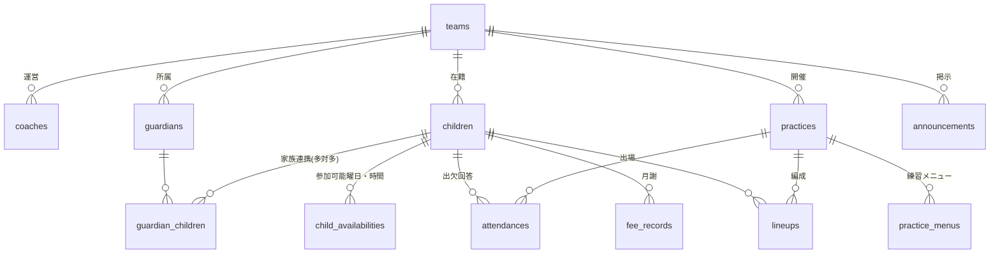

# REQUIREMENTS.md — hoopo(フーポ)要件定義書

最終更新: 2026-08-02 — **v6・要件確定版(名称: hoopo)**(以後の変更は本書を更新してから実装する)

## 1. 背景と目的

ミニバスチームのコーチが、LINEグループで受けている「練習の参加日」「月謝の提出状況」
「練習日程の連絡」を1つのポータルに集約する。保護者は現行のLINE運用から
シームレスに移行でき、コーチは管理画面の操作だけで連絡・集計が完結する状態を目指す。

- 運営: コーチ個人(所属チームでの無償運営)
- 将来: 他チームへの横展開。バックエンドAPIを一元提供し、フロントはSDK配布する
  ヘッドレス型プラットフォーム構想。今回はその第一歩

## 2. 名称・提供形態

- 正式名称(暫定): **hoopo(フーポ)**。英字は小文字で統一(リポジトリ名・ドメインも `hoopo`)
- 本名称は現チーム運用フェーズの名称。**他チームへの横展開時にはバスケットボール全体のプラットフォーム名を別途策定して改名**する前提
- 表記ロックアップ: サイトタイトル・OGP・LIFF名は「**hoopo − ミニバスれんらくポータル**」で統一
- ドメイン第一候補: `hoopo.team`(取得前にCloudflareで空きを確認)
- **テナントブランディング(二層構造)**: 画面の主役はチーム。保護者アプリのヘッダー・予定表画像のヘッダーに「SKC粉浜・北粉浜ミニバスケットボール」のロゴ・チーム名を常時表示し、アプリ名は起動画面と「powered by hoopo」表記に控える。**LINE公式アカウント名はチーム名主体**(例: SKC粉浜・北粉浜 れんらく)とする

- スマホ最適化Webアプリ(**LIFF**)。ネイティブアプリ/ストア配布は行わない
- 導線: LINEグループに貼ったLIFF URLをタップ → 自動ログインでポータルが開く
- 外部ブラウザ(PC等)からは通常のLINEログインにフォールバック
- 管理画面は別アプリ(PC/モバイル両対応)。データベースは共有

## 3. 認証・初回登録

- 保護者: LINEログイン(LIFF)。IDトークンをサーバーで検証し、httpOnly Cookieセッションへ
- 初回登録(2ステップ):
  - ①子ども情報: 名前 / 呼び名(ひらがな・練習で呼ばれる下の名前) / 学年 / 性別(男・女) ※兄弟・姉妹の複数登録可
  - ②参加情報: 参加可能曜日(日〜土のボタン複数選択) / 参加可能時間帯 / コーチへの伝達事項(自由入力・任意) / 続柄(父・母・祖父母・その他の1タップ選択)
  - 兄弟・姉妹を同時登録する場合、②の参加情報は全員に同一適用する(個別調整は部員情報の編集で対応)
- 2回目以降は重複入力を求めない
- 第二保護者: 子どもごとの**招待コード**で連携(父母どちらのLINEアカウントからも同じ子どもを閲覧・提出可)
- 登録は招待コードまたは登録用URL経由のみ。部外者対策は**自動認定+事後確認**方式: 登録・家族連携は即時有効とし、コーチへ通知。心当たりのない登録はコーチが後から無効化できる
- 「コーチへ通知」は LINE 送信ではなく、**管理アプリの認定管理画面に新着順で表示**して事後確認する(§6 通数原則。個別 push は行わない)。招待コードの入力は大文字小文字・ハイフン・空白を区別しない
- 管理者: LINEログイン **または** メールアドレス+パスワードを選択可

## 4. 保護者向けアプリ

### 4.1 ナビゲーション
- フッター5ボタン: **ホーム / 月謝 / 練習日程(中央) / チーム / 提出**
  - 中央の「練習日程」は黒い円形ボタンで強調(最頻利用画面のため)
  - 並び順は仮。最終確認は実装前に行う

### 4.2 画面一覧と仕様
| # | 画面 | 仕様の要点 |
|---|---|---|
| 1 | ログイン | LINEログインのみ。LIFF起動時はスキップ |
| 2 | 初回登録①② | §3の項目。ステップ形式 |
| 3 | ホーム | **チームヘッダー(SKCロゴ+チーム名を常時表示)**、次回練習(日時・場所を大きく)、未提出アラート、**「コーチにLINEで連絡する」ボタン**(コーチ個別LINEのトークURLへ遷移。LINEチャットの送受信は通数カウント対象外)、お知らせ一覧、最下部に「powered by hoopo」 |
| 4 | 練習日程 | **リスト/カレンダーの2形式**。右上トグルで相互切替。カレンダーは日曜始まり・土曜終わり。練習日のみアクティブ(タップ可)。日付タップで詳細(時間/場所/備考/練習メニュー)を表示 |
| 5 | 練習詳細 | **フルスクリーンの詳細ページ**(日程で日付選択→遷移)。時間/場所/備考/**練習メニュー**を表示し、「出場メンバーはこちら」ボタンで当日のコート配置画面へ。別案(チーム画面に公式戦/練習試合タグ+日付選択を挟む構成)は将来検討 |
| 6 | 参加予定の提出 | **リスト/カレンダーの2形式**・完全同期・一括操作あり。回答は日付ごとの**プルダウン選択**: 「9:00〜12:00(全参加)」/「途中参加・早退」/「不参加」+未回答。「途中参加・早退」選択時のみ**任意コメント欄**を活性化(例: 11:00ごろ早退します)。不参加も明示的に選択できる。提出後も変更可。CTAに回答数を表示 |
| 7 | チーム | 初期表示は**全メンバー一覧**(学年・フルネーム・呼び名ひらがな)。コート配置画面は日程詳細から遷移(公式戦/練習試合は日程に紐づく)。コートは**リングを下**にした向き。配置: **C**=リング横(左右は編成時に指定)、**SF/PF**=Cよりセンターサークル寄りで45度からややエンドライン側の角度、**PG/SG**=3Pラインの外側で手前(バックコート側)。初期リリースは**2Dのみ**。3D表示(横から見た床にピンを立て顔写真を表示、右上タブで切替)は**後追いリリース**の拡張機能。下段にベンチ。視覚的に楽しめることを重視 |
| 8 | 月謝確認 | 封筒(1〜12月+済ハンコ)のビンゴ運用をデジタル再現。済/未/未来の3状態。金額と運用注記を表示 |
| 9 | 家族の設定 | 子どもの招待コード表示・コピー、連携済み家族の一覧 |

- 顔写真は任意アップロード。未設定時は頭文字アバターで代替(写真の取り扱いは§9参照)

## 5. 管理者向けアプリ

### 5.1 全体仕様
- 配色: **モノトーン**(オレンジ不使用)。保護者UIと明確に区別する
- **ダークモード対応**(全画面共通、ボタンでワンタップ切替)
- **文字サイズ3段階**(小/中/大、ボタン切替)— 高齢の管理者を想定
- 画面構成は2レイアウト: **PC=左サイドバー**(ダッシュボード/出欠/欠席者/認定/日程/月謝/部員から選択)、**モバイル=ハンバーガーメニュー**(ドロワー表示)。両方のワイヤーフレームを整備(wireframes-v6)

### 5.2 画面一覧
| 画面 | 仕様の要点 |
|---|---|
| ログイン | LINE または メール+パスワード |
| ダッシュボード | 提出率 / 次回参加人数 / 月謝未提出数 |
| 出欠管理 | 部員×練習日マトリクス(**○全参加/△途中参加・早退/×不参加/−未回答**)。△タップで保護者コメント表示。列=当日参加者一覧、行=個人詳細 |
| 欠席者管理 | 練習日ごとに不参加者・途中参加/早退者を保護者コメント付きで一覧表示。未回答者はリマインド対象に指定可 |
| 認定管理 | **自動認定+事後確認**。新規登録・家族連携は即時有効となり、この画面に新着順で表示される(LINE 通知は行わない)。心当たりのない登録・連携を**無効化**でき、無効化した保護者からは当該の子どもが見えなくなる |
| 月謝管理 | 部員×1〜12月の「済」グリッド。セルクリックで済⇄未(封筒ハンコと同運用)。保護者側に即反映 |
| 日程管理 | 月単位で 日付/開始/終了/場所/備考 を行入力。**練習メニュー**を練習ごとに登録(保護者アプリに表示)。「予定表を発行してLINEへ送信」ボタンで画像生成+グループ送信。LINE通数カウンター(n/200)常設 |
| 部員管理 | 名前/学年/性別/連携保護者数/伝達事項。行クリックで詳細(伝達事項全文・参加可能曜日/時間・招待コード)。**年度更新**ボタン |
| チーム編成 | 公式戦/練習試合ごとにスタメン(ポジション割当)とベンチを設定 → 保護者のチーム画面に反映 |

- 年度更新: 全部員の学年+1、6年生は卒団アーカイブ。確認ダイアログ+取り消し猶予つき一括処理

## 6. LINE連携仕様

- LINE公式アカウント+Messaging API(コーチ個人名義で開設・管理)。Botを対象グループに招待し、WebhookでgroupIdを取得
- 通知は**グループ宛て1通のみ**。個別push・全員broadcastは実装しない
- 通数 = 送信回数 × グループ参加人数。無料枠 月200通(超過月は送信不可になる仕様を踏まえ、カウンターで残数を常時表示)
- 必須通知(いずれも詳細は載せず、LIFFリンクへ誘導する短文): 
  1. 予定表発行時(画像+リンク)
  2. 出欠回答を促すリマインド
- 非必須の日常連絡(練習終了等)はアプリから送らない(コーチ個人アカウントで代用)
- お知らせは投稿時に「LINEへ通知する/しない」を選択(notify_lineフラグ)
- 予定表画像: DBのpracticesから**動的生成**(1ヶ月を1日1行で並べ、練習日に時間+学校名。
  現行アプリ「縦型カレンダー」の見慣れた体裁を踏襲)。備考は画像に載せない。
  画像URLは固定パス(例 `/api/schedule/2026-08.png`)でLINEのoriginalContentUrlに渡し、CDNキャッシュ

## 7. データモデル(全テーブルに team_id / RLS必須)

共通事項:

- id は uuid。**teams 以外の全テーブルに team_id**(teams は id 自身がテナント境界のため列を持たない)
- 全テーブルに created_at、更新のある表は updated_at(§5.2 認定管理の登録履歴表示に使用)
- 練習日は「日付+曜日」で保持: held_on(date)から曜日(0=日)を導出した生成列を持つ

テーブル定義:

- teams(id, name, short_name, logo_path, team_color, line_group_id[一意])
- coaches(id, team_id, email[一意], auth_type[line/email], password_hash[email認証時は必須・PBKDF2形式])
  ※ パスワードリセット関連は §10 未決のため未実装。管理者のLINEログインは別Issueで追加
- guardians(id, team_id, line_user_id[暗号文], line_user_id_lookup[検索用HMAC・team内一意])
  ※ 平文の LINE userId 形式は CHECK 制約で拒否。暗号化・HMAC の実装は packages/line の責務
- guardian_children(team_id, guardian_id, child_id, relation[father/mother/grandparent/other], status[active/revoked・自動認定]) — 複合主キー (guardian_id, child_id)
- children(id, team_id, name, nickname_kana[呼び名], grade[1..6], gender[male/female], coach_note, invite_code[全体一意・推測困難], photo_path[任意], status[active/revoked・自動認定], archived, archived_at)
  ※ 卒団は archived=true(grade は据え置き)。archived_at は年度更新の取り消し猶予に使用
- child_availabilities(id, team_id, child_id, weekday[0=日], start_time, end_time) — (child_id, weekday, start_time) 一意
- practices(id, team_id, held_on, weekday[生成列・0=日], start_time, end_time, location, note, published_at)
- practice_menus(id, team_id, practice_id, duration_min, content, sort)
- attendances(id, team_id, child_id, practice_id, status[full/partial/absent], comment[任意・途中参加/早退の詳細。partial 時のみ], submitted_at) — (practice_id, child_id) 一意
- fee_records(id, team_id, child_id, year, month[1..12], status[paid/unpaid], received_at) — (child_id, year, month) 一意。「未来」はアプリが year/month から導出
- announcements(id, team_id, title, body, notify_line, published_at)
- lineups(id, team_id, practice_id, child_id, role[starter/bench], position[PG..C・任意]) — チーム編成用。(practice_id, child_id) 一意

整合性の方針: 子テーブルは複合外部キー(xxx_id, team_id)で親を参照し、他チームの行を参照する
不整合(例: A チームの出欠が B チームの練習を指す)を DB レベルで防ぐ。
LINE 送信ログ・通数カウンター・破壊的操作の実行ログ用テーブルは未定義であり、
該当機能の実装 Issue で本節を更新してから追加する。

### ER図(概念)

カラム定義は上記の一覧が正。図はGitHub上でそのまま描画される(Mermaid)。

## 8. 非機能要件

- コスト: Vercel Hobby(非商用) + Supabase Free + Cloudflare。原則0円/月(唯一の固定費はドメイン)
- Supabase Freeの自動一時停止(約1週間無アクセス)対策として定期ping
- バックアップ: 日次pg_dumpをGitHub Actionsで取得し、R2および自宅Proxmoxへ保管
- 自宅Proxmoxは本番非公開。CIセルフホストランナー/検証環境/バックアップ先として利用
- 監視: Sentry、UptimeRobot。アラートはDiscord Webhook
- 依存更新: Renovate(patch/minorは自動マージ)。CodeQL/secret scanning有効

## 9. セキュリティ・プライバシー

- 保持する個人情報は最小限(CLAUDE.md「絶対原則4」の通り)
- 子どもの**顔写真**は任意機能とし、アップロードは保護者本人のみ・チーム内限定公開。
  未設定時は頭文字アバター。運用開始前に保護者への説明と同意取得を行う(要チーム内合意)
- 招待コードは推測困難な形式。登録・連携は自動認定+事後確認(コーチ通知・無効化可)。卒団時はデータ削除フローを用意
- プライバシーポリシーをアプリ内に掲示

## 10. 未決事項(実装前に確認)

- フッター5ボタンの最終並び順
- 顔写真機能のチーム内合意(§9)
- 予定表画像の細部デザイン(現行スクリーンショットの共有待ち)
- 管理者メールログインのパスワードリセット手段(コスト0のメール送信手段の選定)
- 出場メンバー配置の左右指定(C=リング横の左/右)を lineups にどう持つか(§4.2-7)
- `hoopo` 表記の商標有無の確認(J-PlatPatで9・38・42類を検索)を、チーム外への公開・展開前に実施
